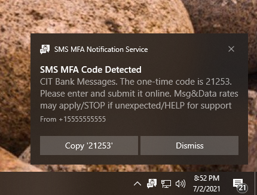

# sms-mfa-notification-service


Desktop notifications for insecure SMS MFA that companies force you to use.

> This is mostly for my personal use (messing with MSIX) - not really intended for external consumption.

## Screenshots



## Architecture

```
Server:
Phone receives text and notifies API (e.g. tasker forwarding text messages)
  -> API sink decodes and processes text.
    -> If MFA was detected, notify all subscribers.

Client:
Desktop app connects to API and subscribes to notifications.
  -> Client receives MFA event and creates a Windows toast with actions.
    -> User clicks an action, Windows dispatches event back to desktop app to perform action.
```

## Signing Builds

Builds are un-signed coming from CI since they require trusted sigatures.

```
$msix = ".\SmsMfaNotificationService.Desktop.Packaging_*_x86.msix"
& $signtool sign /fd SHA256 /a /f "code-signing.pfx" /p <password> /debug $msix
& $signtool sign /tr http://timestamp.entrust.net/TSS/RFC3161sha2TS /td sha256 /fd sha256 $msix
# Which fails, use sha1 selection
& $signtool sign /tr http://timestamp.entrust.net/TSS/RFC3161sha2TS /td sha256 /fd sha256 /sha1 <hash of last sig> $msix
```

(You need both signtool and makeappx inside the same folder)

```
cp (Get-AppxPackage |
 Where Name -Contains "Microsoft.MsixPackagingTool").InstallLocation + "/sdk" ./
```

## Attributions

Icon is _sms security_ by _popcornarts_ from the Noun Project.
